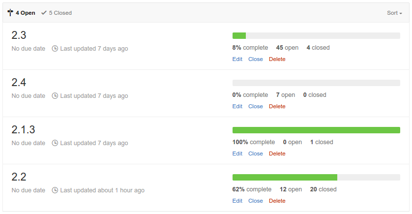
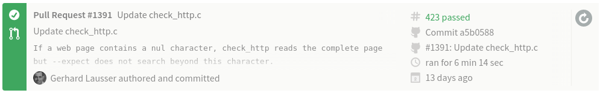
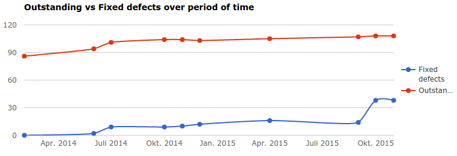

= data-x='-3000' data-y='-2000' data-scale='4' id='title'
## Software Development from DevOps view
### Jan Wagner <waja@cyconet.org>

<br>
<!---->
<!--TODO-->

---
= data-x='0' id='oldtools1'
## Tools we used to manage our software

* vi
* nano
* kate
* joe
* eclipse
* netbeans
* cp
* rsync
* ftp

---
= data-x='1200' id='oldtools2'
## Problems with our (old) tools

* no chronological revisions
* multiple different versions (forks) in production
* multiple different local versions
	* f00b4r.php
	* f00b4r_20040410.php
	* f00b4r_production.php
* distributed via scp/rsync/ftp
<!--TODO-->

---
= data-x='2400' id='vcs'
## Way out?

- __V__ersion __C__ontrol __S__ystem
	- tracks __changes of files and folder__
	- when = date of the commit
	- who = name of author
	- why = commit message

---
= data-x='3600' id='centralvcs1'
## Tools we used to manage our software

* [CVS](https://en.wikipedia.org/wiki/Concurrent_Versions_System)
* [Subversion](https://en.wikipedia.org/wiki/Apache_Subversion)
* [RCS](https://en.wikipedia.org/wiki/Revision_Control_System)

---
= data-x='4800' id='centralvcs2'
## [Client-server version control software](https://en.wikipedia.org/wiki/List_of_version_control_software#Client-server_model)

* One linear software repository
	* with all versions
* Server down, no development


---
= data-x='6000' data-rotate="90" id='whatnext'
## And now?

How to fix some of those issues?


---
= data-x='0' data-y='1000' id='distributedvcs1'
## [Distributed Version Control](https://en.wikipedia.org/wiki/Distributed_version_control) (recently moves)

* [BitKeeper](https://en.wikipedia.org/wiki/BitKeeper)
* [Mercurial / HG](https://en.wikipedia.org/wiki/Mercurial_(software))
* [Bazaar](https://en.wikipedia.org/wiki/Bazaar_(software))
* [Git](https://en.wikipedia.org/wiki/Git_(software))

---
= data-x='1200' data-y='1000' id='distributedvcs2'
## [Distributed Version Control](https://en.wikipedia.org/wiki/Distributed_version_control)

<!--TODO-->


<a style="font-size:xx-small; position: relative; left:980px; top: 55px" href="#centralvcs2">central VCS</a>

---
= data-x='2400' data-y='1000' id='distributedvcs3'
## [Distributed Version Control](https://en.wikipedia.org/wiki/Distributed_version_control)

* Local development possible
	* commiting, branching, tagging ...
	* working offline
* Exchange of code with all participants possible - directly

---
= data-x='3600' data-y='1000' id='dvcsworkflow1'

## Centralized decentralized


<a style="font-size:xx-small; position: relative; left:980px; top: 55px" href="#centralvcs2">central VCS</a> <!--TODO-->

---
= data-x='4800' data-y='1000' id='dvcsworkflow2'

## The usual branches


* ```master``` branch - production ready state
* ```develop``` branch - development (integration) state

---
= data-x='6000' data-y='1000' id='dvcsworkflow3'

## Support branches

* unlike the long-running ```master``` and ```develop``` branches, there are branches with limited life time
* for example there might different types of branches
	- feature (topic) branches
	- release branches
	- hotfix branch

---
= data-x='7200' data-y='1000' id='dvcsworkflow4'

## Feature branches

* May branch of ```develop``` or any other feature branch
* Must merged back into ```develop```
	* If not, it will be discarded (and deleted)
* Branch naming convention needed
* Typically exist in developer repos only, not in origin


---
= data-x='8400' data-y='1000' id='dvcsworkflow5'

## Release branches

* May branch of ```develop```
* Must merged back into ```develop``` AND ```master```
* Branch naming convention: ```release-*```


---
= data-x='9600' data-y='1000' id='dvcsworkflow6'

## Hotfix branches

* May branch of ```master```
* Must merged back into ```develop``` AND ```master```
* Branch naming convention: ```hotfix-*```
* Special form of release branch


---
= data-x='10800' data-y='-1000' id='plugins1'
## [Monitoring Plugins](https://www.monitoring-plugins.org/)
### [Team Communication](https://www.monitoring-plugins.org/support.html)

* [Mailing Lists](https://www.monitoring-plugins.org/support.html)
	* For legacy reasons
	* Mail seems not much loved these days
* [Issues](https://github.com/monitoring-plugins/monitoring-plugins/issues) / [Pull Requests](https://github.com/monitoring-plugins/monitoring-plugins/pulls)
	* Fits developers workflow
* [IRC](http://webchat.freenode.net/?channels=monitoring-plugins)
	* Most usual
	* Realtime communication for peer coding, release work and discussions

---
= data-x='9600' data-y='-1000' id='plugins2'

## [Monitoring Plugins](https://www.monitoring-plugins.org/)
### Usual [branches](https://github.com/monitoring-plugins/monitoring-plugins/branches)

* Development - [_master_ branch](https://github.com/monitoring-plugins/monitoring-plugins/tree/master)
* Hotfixes - [_maint-X.Y_ branch](https://github.com/monitoring-plugins/monitoring-plugins/tree/maint-2.1)
	* usual ```cherry-pick``` from _master_
* Feature - no strict naming convention
	* Pull Requests from external contributors
	* Branches where developers are working on specific problems

---
= data-x='8400' data-y='-1000' id='plugins3'

## [Monitoring Plugins](https://www.monitoring-plugins.org/)
### Special [branches](https://github.com/monitoring-plugins/monitoring-plugins/branches)

* Proposed Updates - [_pu_ branch](https://github.com/monitoring-plugins/monitoring-plugins/tree/pu)
* [Coverity](http://www.coverity.com/why-coverity/) Tests - [_coverity/master_ branch](https://github.com/monitoring-plugins/monitoring-plugins/tree/coverity/master)

---
= data-x='7200' data-y='-1000' id='plugins4'
## [Monitoring Plugins](https://www.monitoring-plugins.org/)
### [Milestones](https://github.com/monitoring-plugins/monitoring-plugins/milestones)

* For priorizing work and problems, we are using [Milestones](https://en.wikipedia.org/wiki/Milestone_(project_management))
* Issues and Pull Requests are targeted for Milestones



---
= data-x='6000' data-y='-1000' id='plugins5'

## [Monitoring Plugins](https://www.monitoring-plugins.org/)
### Code contributions

* via [Pull Requests](https://github.com/monitoring-plugins/monitoring-plugins/pulls)
* Work by [developers](https://www.monitoring-plugins.org/team.html)
	* done in Feature branches
	* even those are reviewed by other members usually through Pull Requests

---
= data-x='4800' data-y='-1000' id='plugins6'

## [Monitoring Plugins](https://www.monitoring-plugins.org/)
### Quality Assurance

* We ship test [cases](http://www.monitoring-plugins.org/doc/guidelines.html#TESTCASES) for plugins and C library functions
* ```make test``` runs those
* Can we take further?
	* Yes we did!

---
= data-x='3600' data-y='-1000' id='plugins7'

## [Monitoring Plugins](https://www.monitoring-plugins.org/)
### Quality Assurance

* Automation with [Travis-CI](https://travis-ci.org)
	* Compiling and [running](https://travis-ci.org/monitoring-plugins/monitoring-plugins/builds/89240468) ```make test``` on every push (to github)



---
= data-x='2400' data-y='-1000' id='plugins8'

## [Monitoring Plugins](https://www.monitoring-plugins.org/)
### Quality Assurance

* Automation with [Travis-CI](https://travis-ci.org)
	* This happens also for Pull Requests
	* Can be observed directly in the PR


---
= data-x='1200' data-y='-1000' id='plugins9'

## [Monitoring Plugins](https://www.monitoring-plugins.org/)
### Quality Assurance

* Reliability of (Travis-)[CI](https://en.wikipedia.org/wiki/Continuous_integration)
	* Only as good as coverage of ```make test```
	* When depending on external infrastructure, this may vary
	* Depends on reliability of CI-infrastructure / build servers


---
= data-x='0' data-y='-1000' id='plugins10'

## [Monitoring Plugins](https://www.monitoring-plugins.org/)
### Quality Assurance

* Code Quality
	* [Static code](https://scan.coverity.com/projects/1435) analysis performed by [Coverity Scan](https://scan.coverity.com/)
	* Merged _master_ via cronjob once a week into _coverity/master_, Travis triggers the Coverity Scan



---
= data-x='0' data-y='2000' id='ci1'

## [Continuous](https://en.wikipedia.org/wiki/Continuous_integration) what? Integration!

Development practice where:

* Developers push code regularly
* (Build and) verified automatically
* Developers (and PM) are notified of the code (and build) status
	* Usually when state changes

---
= data-x='1200' data-y='2000' id='ci2'

## CI - why?

* Be aware of regressions and problems at an early stage
* Increase productivity and project pace
* Increase reliability of your deployments

---
= data-x='2400' data-y='2000' id='ci3'

## CI - Caveat

* Automated tests depends on
	* Quality of your tests
	* Coverage of your tests
* Developers may only focus on succeeding tests
	* Poor tests results into bad code quality

---
= data-x='3600' data-y='2000' id='ci4'

## CI - For (PHP-)Webapplications

* Get an idea see [Travis-CI - Building a PHP project](http://docs.travis-ci.com/user/languages/php/)
* Obviously based on [PHPUnit](https://en.wikipedia.org/wiki/PHPUnit)
* Maybe try [Atoum](https://github.com/atoum/atoum)
* Bulletproof: [Phpunit VW Extension](https://github.com/hmlb/phpunit-vw)

### Cookbooks

* [Testing PHP code using Docker](http://scene-si.org/2015/10/06/testing-php-code-using-docker/)
* [Running PHPUnit in Isolated Environments with Ubuntu, Docker, Gitlab &amp; Gitlab CI](http://dor.ky/running-phpunit-in-isolated-environments-with-ubuntu-docker-gitlab-gitlab-ci/)
* [Continuous Integration With Gitlab CI](http://alanmonger.co.uk/php/continuous/integration/gitlab/ci/docker/2015/08/13/continuous-integration-with-gitlab-ci.html)

---
= data-x='4800' data-y='2000' id='cq1'

## Code Quality

### Overview

* [The PHP Quality Assurance Toolchain](http://phpqatools.org/)
* [PHP: Quality Assurance](https://qa.php.net/write-test.php)

### Additional software packages

* [GrumPHP - composer plugin](https://github.com/phpro/grumphp)
* [Brackets/Edge Code extension - lint PHP files](https://github.com/mikaeljorhult/brackets-php-code-quality-tools)

### Hosted Services

* [Scrutinizer CI](https://scrutinizer-ci.com/)
* [Code Climate](https://codeclimate.com/)
* [SensioLabsInsight](https://insight.sensiolabs.com/)

---
= data-x='6000' data-y='2000' id='agile1'

## Domesticating Developers and Project Management

### Many [Software development methodologies](https://en.wikipedia.org/wiki/List_of_software_development_philosophies#Software_development_methodology)

* [Kanban](https://en.wikipedia.org/wiki/Kanban_(development))
* [Pair programming](https://en.wikipedia.org/wiki/Pair_programming)
* [Scrum](https://en.wikipedia.org/wiki/Scrum_(software_development))

---
= data-x='7200' data-y='2000' id='agile2'

## Kanban Software

* [Kanboard](http://kanboard.net/features)
* [Wekan](https://wekan.io/)
* [Leanlabs Kanban](http://kanban.leanlabs.io/)
* [Kantree](https://kantree.io/)
* [Taiga](https://taiga.io/)
* [Laboard](https://laboard.io/)

---
= data-x='8200' data-y='2000' data-rotate="-90" id='fancy1'

## Some more fancy stuff?

---
= data-x='0' data-y='-2000' id='comm1'

<a href="https://slack.com/is" target="_blank" style="border-bottom:none;"></a>

---
= data-x='1200' data-y='-2000' id='comm2'

## Slack looks promising!

* What if Slack servers are [breached](http://slackhq.com/post/114696167740/march-2015-security-incident-and-launch-of-2fa)?
* What if Slack is sold?
* Is there a __working__ export function?
* Subscription

---
= data-x='2400' data-y='-2000' id='comm3'

<a href="https://status.slack.com/2015-11/ab9ab36aec423f00" target="_blank" style="border-bottom:none;"></a>

---
= data-x='3600' data-y='-2000' id='comm4'

## Why did [Mattermost](http://www.mattermost.org/) [happen](http://www.mattermost.org/why-we-made-mattermost-an-open-source-slack-alternative/)?

_In 2014, Slack became popular in Silicon Valley, and our company adopted it for messaging. But we had a problem–our archives were in our old messaging app. After our subscription expired, the old app wanted us to pay them to access our own data (and export still didn’t work!). We hated being locked in. We fumed. Our discussions, our research, our analyses, and gigabytes of our carefully tagged in-game artwork was all held for ransom by the service we had trusted. Slack was good, but it was another proprietary SaaS app, and we’d just been burned._

---
= data-x='4800' data-y='-2000' id='comm5'

## Selfhosted Slack alternatives

* [What are the best on-site alternatives to Slack?](http://www.slant.co/topics/3346/compare/~rocket-chat_vs_hipchat_vs_zulip)
	* [Mattermost](http://www.mattermost.org/features/)
	* [Rocket.chat](https://rocket.chat/#features)
	* [Zulip](https://www.zulip.org/features.html)

* [Five Open-Source Slack Alternatives](https://blog.okturtles.com/2015/11/five-open-source-slack-alternatives/)

---
= data-x='6000' data-y='-2000' id='matter1'

## Mattermost

<a href="http://www.mattermost.org/category/blog/" target="_blank" style="border-bottom:none;"></a>

---
= data-x='7200' data-y='-2000' data-rotate="180" id='fancy2'

## Do you love fancy stuff?

---
= data-x='0' data-y='-3000' id='chatops1'

## #ChatOps

---
= data-x='1200' data-y='-3000' id='chatops2'

## Devision of #YoloOps

> ChatOps brings the context of work you are already doing into the conversations you are already having. [@jfryman](https://twitter.com/jfryman)

* Remember [Eggdrop](http://www.eggheads.org/) and [IRC](https://en.wikipedia.org/wiki/Internet_Relay_Chat)?
* Now combination of:
	* [Hubot](https://hubot.github.com/), [Lita](https://www.lita.io/), [Err](http://errbot.net/)
	* [Mattermost](http://www.mattermost.org/features/), [Rocket.chat](https://rocket.chat/#features), [Zulip](https://www.zulip.org/features.html)

---
= data-x='2400' data-y='-3000' id='chatops3'

## ChatOps


---
= data-x='3600' data-y='-3000' id='chatops4'

## ChatOps


---
= data-x='4800' data-y='-3000' id='chatops5'

## ChatOps

* [ChatOps at GitHub](https://youtu.be/NST3u-GjjFw)
* [pagerduty: So, What is ChatOps? And How do I Get Started?](https://www.pagerduty.com/blog/what-is-chatops/)
* [ChatOps: Everything about deployments right inside your chat](blog.flowdock.com/2014/11/11/chatops-devops-with-hubot/)
* [Ansible and ChatOps. Get started](https://stackstorm.com/2015/06/24/ansible-chatops-get-started-%F0%9F%9A%80/)
* [To Boost DevOps, Try ChatOps](https://blog.newrelic.com/2015/08/18/chatops/)

---
= data-x='1000' data-y='3000' id='credits'

## Credits

* [SVN Structure](https://upload.wikimedia.org/wikipedia/commons/1/1a/SVN_Server_Client_Structure.png)
* [Git client/server](https://upload.wikimedia.org/wikipedia/commons/a/a3/SVNvsGITServer_2.png)
* [Decentralized but centralized](http://nvie.com/img/centr-decentr@2x.png)
* [The main branches](http://nvie.com/img/main-branches@2x.png)
* [Feature branches](http://nvie.com/img/fb@2x.png)
* [Flow](http://lanziani.com/slides/gitflow/images/gitflow_1.png)
* [Hotfix branch](http://nvie.com/img/hotfix-branches@2x.png)
* [Slack](https://slack.global.ssl.fastly.net/66f9/img/tour/tools.png)
* [Slack Status](https://pbs.twimg.com/media/CUhZezyWsAEGC-e.jpg)
* [Mattermost latest features](http://www.mattermost.org/wp-content/uploads/2015/11/Mattermost-v1.2.gif)
* [NewRelic ChatOps](https://blog.newrelic.com/wp-content/uploads/new-relic-chat.jpg)
* [PagerDuty ChatOps](https://www.pagerduty.com/assets/blog/Screen-Shot-2014-12-02-at-2.11.12-PM-1024x569.png)

---
= data-x='-3000' data-y='1000' data-scale='4' id='slides'

## Slides

* [http://url/](http://url/)
* Lizenz: [CC-SA-3.0-DE](https://creativecommons.org/licenses/by-sa/3.0/de/)
* Mail: Jan Wagner <waja@cyconet.org>
