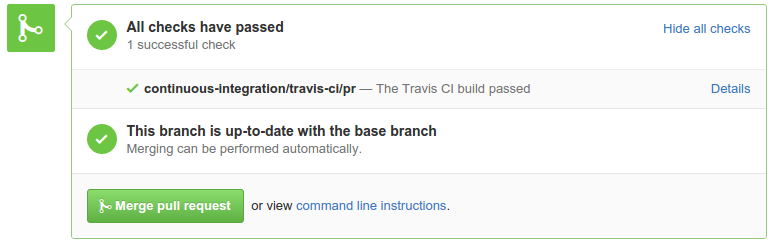

## Software Development from DevOps view
### Jan Wagner <waja@cyconet.org>

<br>

<!--TODO-->

---
= data-x='1000' id='oldtools1'
## Tools we used to manage our software

* cp
* rsync
* vi
* nano
* kate
* joe
* eclipse
* netbeans

---
= data-x='1000' id='oldtools2'
## Problems with our (old) tools

* no chronological revisions
* multiple different versions (forks) in production
* multiple different local versions
	* f00b4r.php
	* f00b4r_20040410.php
	* f00b4r_production.php
* distributed via scp/rsync
<!--TODO-->

---
= data-x='1000' id='vcs'
## Way out?

- __V__ersion __C__ontrol __S__ystem
	- tracks __changes of files and folder__
	- when = date of the commit
	- who = name of author
	- why = commit message

---
= data-x='1000' id='centralvcs1'
## Tools we used to manage our software

* [CVS](https://en.wikipedia.org/wiki/Concurrent_Versions_System)
* [Subversion](https://en.wikipedia.org/wiki/Apache_Subversion)
* [RCS](https://en.wikipedia.org/wiki/Revision_Control_System)

---
= data-x='1000' id='centralvcs2'
## [Client-server version control software](https://en.wikipedia.org/wiki/List_of_version_control_software#Client-server_model)

* One linear software repository
	* with all versions
* Server down, no development


---
= data-x='1000' data-rotate="90" id='whatnext'
## And now?

* How to fix some of those issues?
<!--TODO - Entertainment-->

---
= data-x='1000' id='distributedvcs1'
## [Distributed Version Control](https://en.wikipedia.org/wiki/Distributed_version_control) (recently moves)

* [BitKeeper](https://en.wikipedia.org/wiki/BitKeeper)
* [Mercurial / HG](https://en.wikipedia.org/wiki/Mercurial_(software))
* [Bazaar](https://en.wikipedia.org/wiki/Bazaar_(software))
* [Git](https://en.wikipedia.org/wiki/Git_(software))

---
= data-x='1000' id='distributedvcs2'
## [Distributed Version Control](https://en.wikipedia.org/wiki/Distributed_version_control)

<!--TODO-->


---
= data-x='1000' id='distributedvcs2'
## [Distributed Version Control](https://en.wikipedia.org/wiki/Distributed_version_control)

* Local development possible
	* commiting, branching, tagging ...
	* working offline
* Exchange of code with all participants possible - directly

---
= data-x='1000' id='dvcsworkflow1'

## Centralized decentralized


<a style="font-size:xx-small; position: relative; left:580px; top: 55px" href="#centralvcs2">central VCS</a> <!--TODO-->

---
= data-x='1000' id='dvcsworkflow2'

## The usual branches


* ```master``` branch - production ready state
* ```develop``` branch - development (integration) state

---
= data-x='1000' id='dvcsworkflow3'

## Support branches

* unlike the long-running ```master``` and ```develop``` branches, there are branches with limited life time
* for example there might different types of branches
	- feature (topic) branches
	- release branches
	- hotfix branch

---
= data-x='1000' id='dvcsworkflow4'

## Feature branches

* May branch of ```develop``` or any other feature branch
* Must merged back into ```develop```
	* If not, it will be discarded (and deleted)
* Branch naming convention needed
* Typically exist in developer repos only, not in origin


---
= data-x='1000' id='dvcsworkflow5'

## Release branches

* May branch of ```develop```
* Must merged back into ```develop``` AND ```master```
* Branch naming convention: ```release-*```


---
= data-x='1000' id='dvcsworkflow6'

## Hotfix branches

* May branch of ```master```
* Must merged back into ```develop``` AND ```master```
* Branch naming convention: ```hotfix-*```
* Special form of release branch


---
= data-x='1000' id='plugins1'
## [Monitoring Plugins](https://www.monitoring-plugins.org/)
### [Team Communication](https://www.monitoring-plugins.org/support.html)

* [Mailing Lists](https://www.monitoring-plugins.org/support.html)
	* For legacy reasons
	* Mail seems not much loved these days
* [Issues](https://github.com/monitoring-plugins/monitoring-plugins/issues) / [Pull Requests](https://github.com/monitoring-plugins/monitoring-plugins/pulls)
	* Fits developers workflow
* [IRC](http://webchat.freenode.net/?channels=monitoring-plugins)
	* Most usual
	* Realtime communication for peer coding, release work and discussions

---
= data-x='1000' id='plugins2'

## [Monitoring Plugins](https://www.monitoring-plugins.org/)
### Usual [branches](https://github.com/monitoring-plugins/monitoring-plugins/branches)

* Development - [_master_ branch](https://github.com/monitoring-plugins/monitoring-plugins/tree/master)
* Hotfixes - [_maint-X.Y_ branch](https://github.com/monitoring-plugins/monitoring-plugins/tree/maint-2.1)
	* usual ```cherry-pick``` from _master_
* Feature - no strict naming convention
	* Pull Requests from external contributors
	* Branches where developers are working on specific problems

---
= data-x='1000' id='plugins3'

## [Monitoring Plugins](https://www.monitoring-plugins.org/)
### Special [branches](https://github.com/monitoring-plugins/monitoring-plugins/branches)

* Proposed Updates - [_pu_ branch](https://github.com/monitoring-plugins/monitoring-plugins/tree/pu)
* [Coverity](http://www.coverity.com/why-coverity/) Tests - [_coverity/master_ branch](https://github.com/monitoring-plugins/monitoring-plugins/tree/coverity/master)

---
= data-x='1000' id='plugins4'
## [Monitoring Plugins](https://www.monitoring-plugins.org/)
### [Milestones](https://github.com/monitoring-plugins/monitoring-plugins/milestones)

* For priorizing work and problems, we are using [Milestones](https://en.wikipedia.org/wiki/Milestone_(project_management))
* Issues and Pull Requests are targeted for Milestones


---
= data-x='1000' id='plugins5'

## [Monitoring Plugins](https://www.monitoring-plugins.org/)
### Code contributions

* via [Pull Requests](https://github.com/monitoring-plugins/monitoring-plugins/pulls)
* Work by [developers](https://www.monitoring-plugins.org/team.html)
	* done in Feature branches
	* even those are reviewed by other members usually through Pull Requests

---
= data-x='1000' id='plugins6'

## [Monitoring Plugins](https://www.monitoring-plugins.org/)
### Quality Assurance

* We ship test [cases](http://www.monitoring-plugins.org/doc/guidelines.html#TESTCASES) for plugins and C library functions
* ```make test``` runs those
* Can we take further?
	* Yes we did!

---
= data-x='1000' id='plugins7'

## [Monitoring Plugins](https://www.monitoring-plugins.org/)
### Quality Assurance

* Automation with [Travis-CI](https://travis-ci.org)
	* Compiling and [running](https://travis-ci.org/monitoring-plugins/monitoring-plugins/builds/89240468) ```make test``` on every push (to github)


---
= data-x='1000' id='plugins8'

## [Monitoring Plugins](https://www.monitoring-plugins.org/)
### Quality Assurance

* Automation with [Travis-CI](https://travis-ci.org)
	* This happens also for Pull Requests
	* Can be observed directly in the PR



---
= data-x='1000' id='plugins9'

## [Monitoring Plugins](https://www.monitoring-plugins.org/)
### Quality Assurance

* Reliability of (Travis-)[CI](https://en.wikipedia.org/wiki/Continuous_integration)
	* Only as good as coverage of ```make test```
	* When depending on external infrastructure, this may vary
	* Depends on reliability of CI-infrastructure / build servers


---
= data-x='1000' id='plugins10'

## [Monitoring Plugins](https://www.monitoring-plugins.org/)
### Quality Assurance

* Code Quality
	* [Static code](https://scan.coverity.com/projects/1435) analysis performed by [Coverity Scan](https://scan.coverity.com/)
	* Merged _master_ via cronjob once a week into _coverity/master_, Travis triggers the Coverity Scan


---
= data-x='1000' id='ci1'

## [Continuous](https://en.wikipedia.org/wiki/Continuous_integration) what? Integration!

Development practice where:

* Developers push code regularly
* (Build and) verified automatically
* Developers (and PM) are notified of the code (and build) status
	* Usually when state changes

---
= data-x='1000' id='ci2'

## CI - why?

* Be aware of regressions and problems at an early stage
* Increase productivity and project pace
* Increase reliability of your deployments

---
= data-x='1000' id='ci3'

## CI - Caveat

* Automated tests depends on
	* Quality of your tests
	* Coverage of your tests
* Developers may only focus on succeeding tests
	* Poor tests results into bad code quality

---
= data-x='1000'
## Slides

* [http://url/](http://url/)
* Lizenz: [CC-SA-3.0-DE](https://creativecommons.org/licenses/by-sa/3.0/de/)
* Mail: Jan Wagner <waja@cyconet.org>  


## Credits

* [SVN Structure](https://upload.wikimedia.org/wikipedia/commons/1/1a/SVN_Server_Client_Structure.png)
* [Git client/server](https://upload.wikimedia.org/wikipedia/commons/a/a3/SVNvsGITServer_2.png)
* [Decentralized but centralized](http://nvie.com/img/centr-decentr@2x.png)
* [The main branches](http://nvie.com/img/main-branches@2x.png)
* [Feature branches](http://nvie.com/img/fb@2x.png)
* [Flow](http://lanziani.com/slides/gitflow/images/gitflow_1.png)
* [Hotfix branch](http://nvie.com/img/hotfix-branches@2x.png)
* [Foo](http://foo.bar) by FooBar
